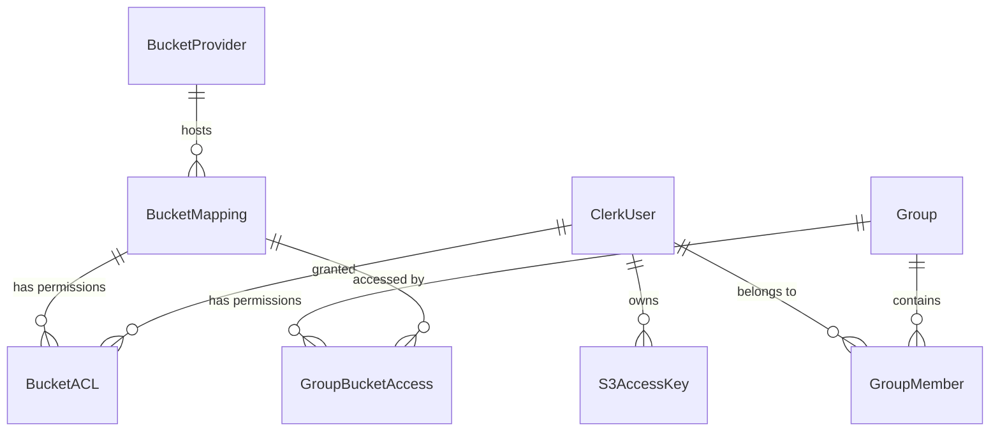

# VFX.sh Worker API & Frontend Integration Guide

**Version**: 1.0.0
**Base URL**: `https://api.vfx.sh` (or `http://localhost:8787` for local dev)

This document outlines the API structure, data models, and logic required to build the Frontend Dashboard (Admin & User Console).

---

## 1. Authentication & Security

### Auth Provider: Clerk
The frontend uses **Clerk** for user authentication.
- **Frontend SDK**: `@clerk/clerk-react`
- **Headers**: All API requests MUST include the session token.
  ```http
  Authorization: Bearer <clerk_session_token>
  ```

### Role-Based Access Control (RBAC)
The system distinguishes between two primary roles:
1.  **Admin**: Full access to all resources (Providers, Buckets, Groups, All Users).
2.  **User**: Limited access. Can only manage their own Access Keys and view buckets explicitly granted to them via Groups or direct ACLs.

---

## 2. Dashboard Logic & User Experience

### Admin View
Top-level Navigation:
- **Providers**: Manage S3 backend connections (iDrive, Backblaze, AWS).
- **Buckets**: Map global bucket names to Providers.
- **Groups**: Manage Teams / User Groups.
- **Users**: View all users, manage their specific ACLs and Keys.
- **Access Keys**: Global view of all generated keys (audit).

### User View
Top-level Navigation:
- **My Access Keys**: Generate S3 credentials for their tools (Cyberduck, Rclone).
- **My Buckets**: List of buckets they have read/write access to.
- **Settings**: Account management (via Clerk).

---

## 3. Data Models

### Logic Diagram


### TypeScript Interfaces

#### Provider
```typescript
interface BucketProvider {
  id: string; // Internal UUID
  name: string; // Friendly name (e.g. "iDrive Europe")
  endpoint_url: string; // https://s3.us-west-1.idrive e2-47.com
  region: string; // us-east-1
  enabled: boolean;
  created_at: string;
}
```

#### Bucket Mapping
```typescript
interface BucketMapping {
  bucket_name: string; // The URL subdomain (e.g. 'client-a' -> client-a.vfx.sh)
  provider_id: string;
  remote_bucket_name: string; // Actual bucket on provider
  provider_name?: string; // Joined field
}
```

#### Group
```typescript
interface Group {
  id: string;
  name: string;
  description?: string;
  members_count?: number; // Computed
}
```

#### S3 Access Key
```typescript
interface S3AccessKey {
  access_key_id: string; // "VFXSH..."
  secret_key?: string; // ONLY returned on creation
  user_id: string;
  name?: string; // "Render Farm Node 1"
  expiration?: string; // ISO Date
  created_at: string;
}
```

---

## 4. API Reference

### A. Providers (Admin Only)

| Method | Endpoint | Description | Body |
|:---|:---|:---|:---|
| `GET` | `/admin/providers` | List all storage backends | - |
| `POST` | `/admin/providers` | Add new backend | `CreateProviderRequest` |
| `PUT` | `/admin/providers/:id` | Update backend details | `UpdateProviderRequest` |
| `DELETE` | `/admin/providers/:id` | Remove backend (fails if used) | - |

**CreateProviderRequest**:
```json
{
  "id": "idrive-eu",
  "name": "iDrive Europe",
  "endpoint_url": "https://...",
  "region": "us-east-1",
  "access_key_id": "...",
  "secret_access_key": "..."
}
```

---

### B. Buckets (Admin Only)

| Method | Endpoint | Description | Body |
|:---|:---|:---|:---|
| `GET` | `/admin/buckets` | List all bucket mappings | - |
| `POST` | `/admin/buckets` | Map a new sub-domain | `CreateBucketRequest` |
| `DELETE` | `/admin/buckets/:name` | Remove bucket mapping | - |

**CreateBucketRequest**:
```json
{
  "bucket_name": "dailies",  // becomes dailies.vfx.sh
  "provider_id": "idrive-eu",
  "remote_bucket_name": "dailies-backup-v1" // optional, defaults to bucket_name
}
```

---

### C. Groups (Admin Only)

Manage teams and their permissions.

| Method | Endpoint | Description | Body |
|:---|:---|:---|:---|
| `GET` | `/admin/groups` | List groups | - |
| `GET` | `/admin/groups/:id` | Get group details, members & permissions | - |
| `POST` | `/admin/groups` | Create group | `{ "id": "edit", "name": "Editors" }` |
| `POST` | `/admin/groups/:id/members` | Add user to group | `{ "userId": "user_..." }` |
| `DELETE` | `/admin/groups/:id/members/:uid` | Remove user from group | - |
| `POST` | `/admin/groups/:id/access` | Grant bucket access | `{ "bucket": "dailies", "permission": "read" }` |

**Permissions**: `read`, `write`, `admin`.

---

### D. User Access Keys & ACLs

#### Admin Operations
- `GET /admin/keys`: List ALL keys in the system.
- `DELETE /admin/keys/:id`: Revoke any key.
- `GET /admin/users/:id/acl`: See specific user permissions.
- `PUT /admin/users/:id/acl`: Set specific permissions (overrides Group permissions).

#### User Operations (Self-Service)
*Note: These endpoints are usually under `/api/me` or handled by the Admin API checking `auth.userId`.*
*Currently, the backend implements Admin Routes mainly. For the MVP, Users might need to ask Admins or we open up `/user/keys` endpoints.*

**Current Implementation**: 
The [src/routes/admin.ts](file:///Users/heymarcell/DEV/vfxsh-worker/src/routes/admin.ts) file currently protects ALL routes with [requireAdmin](file:///Users/heymarcell/DEV/vfxsh-worker/src/routes/admin.ts#19-36). 
**Frontend Requirement**: The Dashboard currently serves **Admins**. 
*To support Self-Service Users, we need to expose non-admin routes.*

---

## 5. Development Tips

### Error Handling
- **401 Unauthorized**: User is not logged in. Redirect to Clerk Login.
- **403 Forbidden**: User logged in but is NOT an Admin. Show "Access Denied" or limited view.
- **404 Not Found**: ID invalid.
- **409 Conflict**: Trying to create duplicate ID or delete provider in use.

### Validation
- **Bucket Names**: 3-63 chars, lowercase, numbers, hyphens. No underscores.
- **Endpoints**: Must be valid URLs.

### Caching
- The worker aggressively caches auth and routing data in Cloudflare KV (Default 5 mins). 
- **Admin Actions** (Create/Delete) automatically invalidate this cache. 
- Updates should be reflected instantly.
